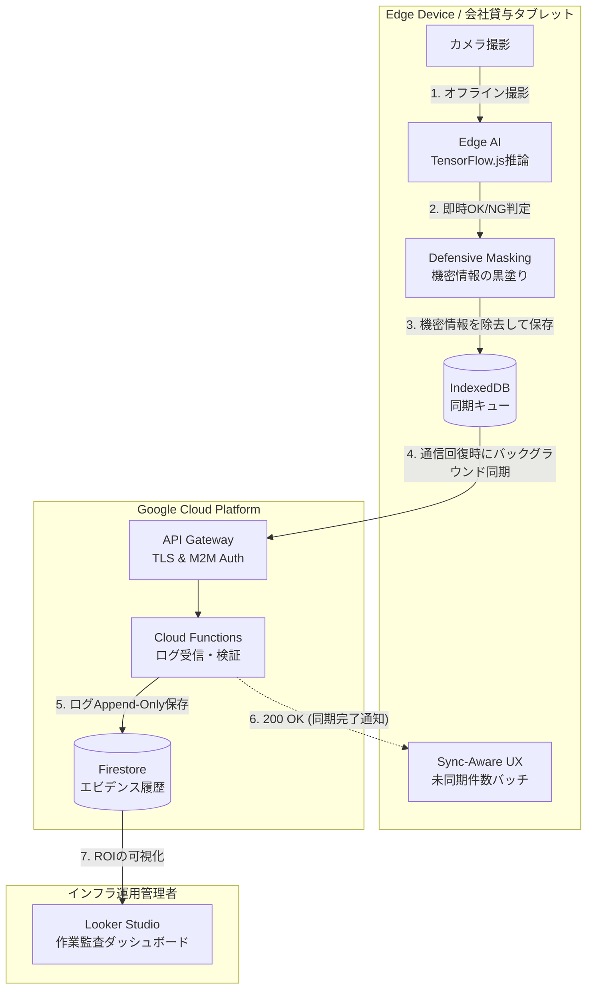
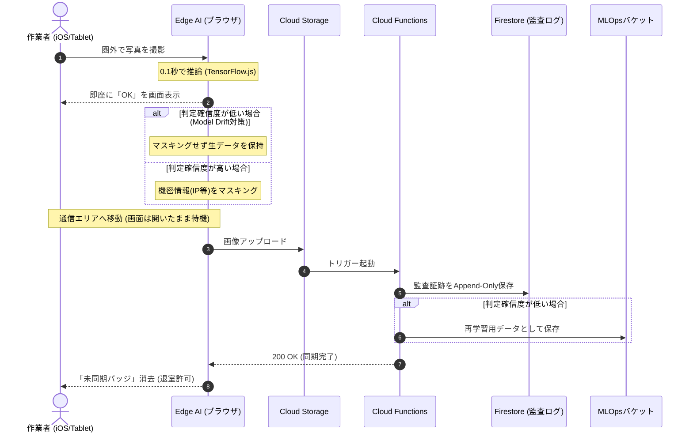

# 提案書：Visual Check Validator (VCV)
〜Edge AIとGCPを用いた、データセンター配線監査と作業エビデンス化システム〜

## 1. Executive Summary (背景と目的)
データセンターやインフラ構築の現場において、LANケーブルの「誤抜線」や「ポート挿し間違い」は、大規模なシステムダウンを引き起こす致命的なヒューマンエラーです。現在これを防ぐために「2人1組での指差喚呼・目視確認」を行っていますが、人間の感覚（やったつもり）に依存しているため事故をゼロにすることはできません。
本プロジェクトでは、**会社貸与の専用タブレット（Edge AI）とGCP（Google Cloud Platform）**を活用し、物理的な配線作業が正しく行われたことを「AIによる客観的な画像エビデンス」として自動判定・記録するシステムを構築しました。

## 2. Architecture Decision (アーキテクチャ選定の理由)
データセンター特有の「完全圏外（電波暗室）」「厳しい情報持ち出し制限」をクリアするため、クラウド依存のAIを棄却し、以下のハイブリッド・アーキテクチャを採用しました。

1. **Edge AI (TensorFlow.js) による完全オフライン判定:**
   電波の届かないサーバールーム内でも、端末単体で0.1秒でOK/NG判定を出すエッジ推論アーキテクチャを採用し、作業者の待ち時間をゼロにしました。
2. **Defensive Masking (エッジ側での機密情報マスキング):**
   証拠画像をGCP（クラウド）へアップロードする前に、端末内で「IPアドレスやホスト名のテプラ」を検知して黒塗り（マスキング）処理を行うことで、重大な情報漏洩リスクを物理的に遮断しています。
3. **GCP Serverless (Cloud Functions / Firestore):**
   通信エリアへ復帰後の事後ログ・証拠画像の収集基盤として、運用コストが最小化できるGCPのサーバーレス構成を採用しています。

## 3. System Architecture (システム構成)

本システムは、現場からの画像アップロードを起点に、GCP内で判定からエビデンス保存までが完結するシンプルな構成です。外部SaaSへの複雑な書き込み連携がないため、極めて堅牢で障害に強い設計です。

### 3-1. 静的コンポーネント構成

### 3-2. 動的処理フロー (Offline-First & MLOps)
iOSのBackground Sync非対応という制約を運用UXでカバーしつつ、AIの品質監視（Data Feedback Loop）を実現する時間軸のフローです。

## 4. エンタープライズ品質の設計（NFR: 非機能要件）
単なる技術デモではなく、運用現場の修羅場を想定した「破綻しない設計」を実装しています。

### 4-1. バックグラウンド同期とSilent Failureの防止 (Resilience)
エッジ側でOKが出ても、クラウドへの同期が裏で失敗（トークン切れ等）すると「エビデンスが残っていない」という重大な静かなる失敗（Silent Failure）に繋がります。これを防ぐため、UI上に「未同期〇件」というバッジを常時表示し、**「GCPから200 OKが返却され、未同期が0件になって初めて『作業完了（退室可能）』とする」**というSync-Awareな完了定義（DoD）を徹底しています。

### 4-2. 物理運用コストのコントロール (Chesterton's Fence)
AIの認識精度を100%にするため、ポートとケーブルに「ARマーカー」を貼る設計としましたが、数万本の全ケーブルに貼る運用は人件費（運用コスト）の観点で破綻します。そのため、本システムは**「間違えると致命的な障害に直結するコアスイッチのアップリンク（全体の約5%）のみを対象とする」**ビジネス要件に限定し、技術と運用のROIを最適化しています。

### 4-3. 証拠の永続化と監査可能性 (Auditability)
GCP上のFirestore設計は、ドキュメントの「上書き（Update）」を禁じ、すべて「追記（Append-Only）」とする履歴テーブル設計を採用。これにより「いつ・誰が・どのポートを作業したか」の完全な証跡が残り、インシデント発生時の原因究明（RCA）や、システムの導入効果（ROI）証明を容易にしています。

### 4-4. FinOpsと監査要件の両立 (Cost Optimization & Compliance)
クラウドAI（Vertex AI等）特有の「リクエストゼロでも発生するエンドポイント待機コスト（Scale-to-Zero非対応の罠）」を回避するため、モデルの学習を完全無料環境（Colab等）へオフロードし、推論を「Edge AI」で行うことでAI関連のランニングコストを完全にゼロ化しています。
また、画像をエッジ側で圧縮して通信コストを極小化し、Cloud Storageには「一定期間で画像をArchiveクラス（超低価格層）へ自動階層化する」ライフサイクル管理を強制適用。これにより、GCPの「Always Free（無料枠）」の範囲内で安全にPoCを開始しつつ、エンタープライズに求められる数年間の監査証跡保存義務を満たす設計としています。

### 4-5. MLOps (AI品質の継続的監視)
Edge AIに判定を完全オフロードすると、クラウド側でAIの劣化（Model Drift）に気づけないという課題が発生します。本システムでは、エッジ側で判定の確信度（Confidence Score）が低いと判断された画像（全体の数%）のみを、マスキングせずに監査用バケットへサンプリング送信する「Data Feedback Loop」を実装し、継続的なAIモデルの再学習を可能にしています。
