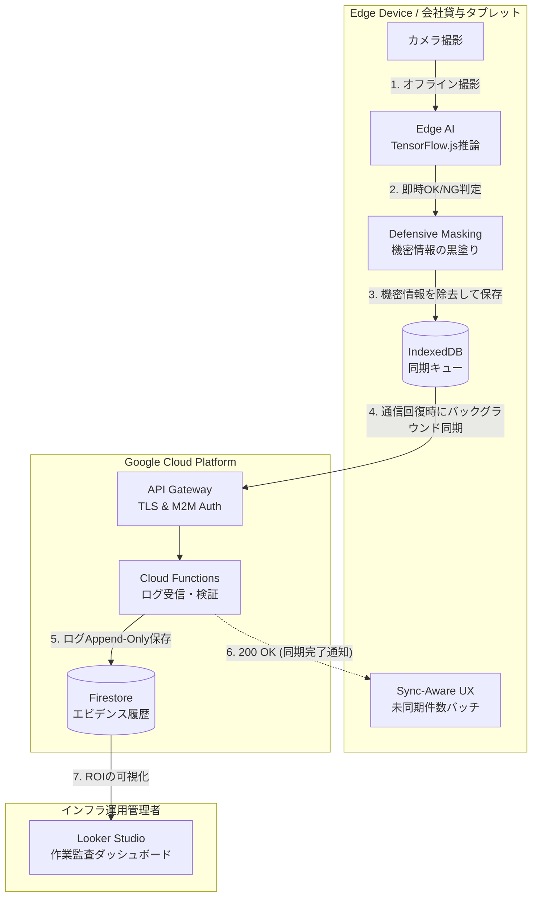
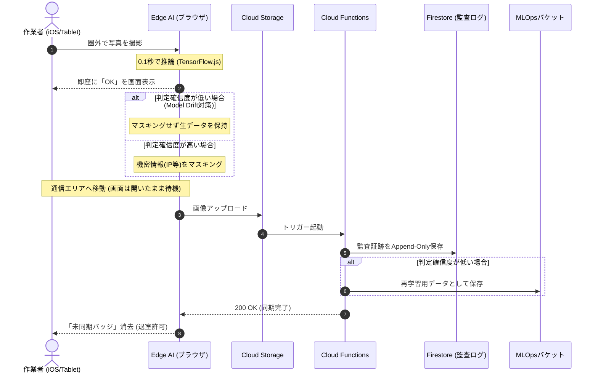

# 提案書：Visual Check Validator (VCV)
〜Edge AIとGCPを用いた、データセンター配線監査と作業エビデンス化システム〜

## 1. Executive Summary (背景と目的)
データセンターやインフラ構築の現場において、LANケーブルの「誤抜線」や「ポート挿し間違い」は、大規模なシステムダウンを引き起こす致命的なヒューマンエラーです。現在これを防ぐために「2人1組での指差喚呼・目視確認」を行っていますが、人間の感覚（やったつもり）に依存しているため事故をゼロにすることはできません。
本プロジェクトでは、**会社貸与の専用タブレット（Edge AI）とGCP（Google Cloud Platform）**を活用し、物理的な配線作業が正しく行われたことを「AIによる客観的な画像エビデンス」として自動判定・記録するシステムを構築しました。

## Tech Stack (技術スタック)
本プロジェクトは、iOSタブレットでの完全オフライン動作とエッジ推論を実現するため、以下の技術スタックを採用しています。詳細な選定理由とトレードオフ（iOS Safari特有の制約等）については、[ADR-004](docs/adr/004_tech_stack_selection.md) を参照してください。

*   **Frontend:** React (Vite) + TypeScript + PWA (Service Worker)
*   **Edge AI:** TensorFlow.js (tfjs-backend-webgl / wasm)
*   **Local Storage:** Dexie.js (IndexedDB)
*   **Cloud / Backend:** Firebase (Firestore / Cloud Storage / Cloud Functions)

## 2. Architecture Decision (アーキテクチャ選定の理由)
データセンター特有の「完全圏外（電波暗室）」「厳しい情報持ち出し制限」をクリアするため、クラウド依存のAIを棄却し、以下のハイブリッド・アーキテクチャを採用しました。

1. **Edge AI (TensorFlow.js) による完全オフライン判定:**
   電波の届かないサーバールーム内でも、端末単体で0.1秒でOK/NG判定を出すエッジ推論アーキテクチャを採用し、作業者の待ち時間をゼロにしました。
2. **Defensive Masking (エッジ側での機密情報マスキング):**
   証拠画像をGCP（クラウド）へアップロードする前に、端末内で「IPアドレスやホスト名のテプラ」を検知して黒塗り（マスキング）処理を行うことで、重大な情報漏洩リスクを物理的に遮断しています。
3. **GCP Serverless (Cloud Functions / Firestore):**
   通信エリアへ復帰後の事後ログ・証拠画像の収集基盤として、運用コストが最小化できるGCPのサーバーレス構成を採用しています。

## 3. System Architecture (システム構成)

本システムは、現場からの画像アップロードを起点に、GCP内で判定からエビデンス保存までが完結するシンプルな構成です。外部SaaSへの複雑な書き込み連携がないため、極めて堅牢で障害に強い設計です。

### 3-1. 静的コンポーネント構成


### 3-2. 動的処理フロー (Offline-First & MLOps)
iOSのBackground Sync非対応という制約を運用UXでカバーしつつ、AIの品質監視（Data Feedback Loop）を実現する時間軸のフローです。



## 4. エンタープライズ品質の設計（NFR: 非機能要件）
単なる技術デモではなく、運用現場の修羅場を想定した「破綻しない設計」を実装しています。

### 4-1. バックグラウンド同期とSilent Failureの防止 (Resilience)
エッジ側でOKが出ても、クラウドへの同期が裏で失敗（トークン切れ等）すると「エビデンスが残っていない」という重大な静かなる失敗（Silent Failure）に繋がります。これを防ぐため、UI上に「未同期〇件」というバッジを常時表示し、**「GCPから200 OKが返却され、未同期が0件になって初めて『作業完了（退室可能）』とする」**というSync-Awareな完了定義（DoD）を徹底しています。

### 4-2. 物理運用コストのコントロール (Chesterton's Fence)
AIの認識精度を100%にするため、ポートとケーブルに「ARマーカー」を貼る設計としましたが、数万本の全ケーブルに貼る運用は人件費（運用コスト）の観点で破綻します。そのため、本システムは**「間違えると致命的な障害に直結するコアスイッチのアップリンク（全体の約5%）のみを対象とする」**ビジネス要件に限定し、技術と運用のROIを最適化しています。

### 4-3. 証拠の永続化と監査可能性 (Auditability)
GCP上のFirestore設計は、ドキュメントの「上書き（Update）」を禁じ、すべて「追記（Append-Only）」とする履歴テーブル設計を採用。これにより「いつ・誰が・どのポートを作業したか」の完全な証跡が残り、インシデント発生時の原因究明（RCA）や、システムの導入効果（ROI）証明を容易にしています。

### 4-4. FinOpsと監査要件の両立 (Cost Optimization & Compliance)
クラウドAI（Vertex AI等）特有の「リクエストゼロでも発生するエンドポイント待機コスト（Scale-to-Zero非対応の罠）」を回避するため、モデルの学習を完全無料環境（Colab等）へオフロードし、推論を「Edge AI」で行うことでAI関連のランニングコストを完全にゼロ化しています。
また、画像をエッジ側で圧縮して通信コストを極小化し、Cloud Storageには「一定期間で画像をArchiveクラス（超低価格層）へ自動階層化する」ライフサイクル管理を強制適用。これにより、GCPの「Always Free（無料枠）」の範囲内で安全にPoCを開始しつつ、エンタープライズに求められる数年間の監査証跡保存義務を満たす設計としています。

### 4-5. MLOps (AI品質の継続的監視)
Edge AIに判定を完全オフロードすると、クラウド側でAIの劣化（Model Drift）に気づけないという課題が発生します。本システムでは、エッジ側で判定の確信度（Confidence Score）が低いと判断された画像（全体の数%）のみを、マスキングせずに監査用バケットへサンプリング送信する「Data Feedback Loop」を実装し、継続的なAIモデルの再学習を可能にしています。

## 5. PoC（実証実験）の終了基準（Exit Criteria）
本プロジェクトを全社展開（本番導入）するかどうかのGo/No-Goを判断するため、PoCフェーズにおける定量的かつ客観的な終了基準を以下に定義します。技術的実現性だけでなく、実際のビジネス価値（運用コスト削減効果）も評価対象とします。

### 5-1. 技術的実現性 (Technical Feasibility)
*   **AI認識精度:** コアスイッチ対象ポート（マーカー貼付済み）における、Edge AIの「ポート番号・ケーブルのOK/NG判定」の正解率が **95%以上** であること。
*   **通信の堅牢性:** 完全オフライン環境（サーバールーム内）からオンライン復帰後、エッジ内に滞留したエビデンス画像のGCPへのバックグラウンド同期成功率が **100%**（未同期バッジが確実に0件になること）であること。

### 5-2. ビジネス価値 (Business Value / ROI)
*   **作業時間の短縮:** 既存の「2人1組での指差喚呼・チェックシート記入」プロセスと比較し、本システムを利用した単独作業での「1ポートあたりのエビデンス記録〜退室確認までのトータル所要時間」が、**同等あるいは短縮（＋10秒以内のオーバーヘッド）に収まること**。
*   ※本システム導入により、長期的には「人的ミスによる障害対応コスト（数千万円規模）」が削減される見込みですが、PoC段階では「現場スタッフのUXを阻害しないか」を最重要指標とします。

## 6. 開発・起動方法 (Getting Started)

本プロジェクトはエッジ推論（WebカメラとGPU）を使用するため、ローカル開発環境でもいくつか要件があります。

### 前提条件 (Prerequisites)
* Node.js (v20以上推奨)
* Webカメラが搭載・接続されたPC
* 推奨ブラウザ: Google Chrome (TensorFlow.js の WebGL アクセラレーションに最適化されているため)

### 起動手順

1. **依存関係のインストール:**
   ```bash
   npm install
   ```

2. **ローカル開発サーバーの起動:**
   ```bash
   npm run dev
   ```
   ターミナルに表示されたローカルURL（例: `http://localhost:5173`）にブラウザでアクセスしてください。

3. **カメラの許可:**
   ブラウザから「カメラの使用許可」を求められますので、必ず「許可」してください。許可しないとアプリは動作しません。

### ローカルでのオフライン動作テスト (PWA/Sync-Aware UX)
本番環境と同じ「圏外（オフライン）でのエビデンス保持」をローカルでテストする場合は以下の手順を踏みます。

1. Chromeのデベロッパーツール（F12）を開く。
2. `Network` タブを開き、スロットリング設定を `No throttling` から `Offline` に変更する。
3. カメラでスキャンを実行し、Dexie (IndexedDB) に未同期レコードが保存され、UIの「☁️ 未同期」バッジが増えることを確認する。
4. 設定を `Online` に戻し、通信回復によってバックグラウンド同期が走り、バッジが0件（退室可能状態）になることを確認する。
