# ADR-007: PWAオフライン同期戦略とTensorFlow.jsモデルのIndexedDBネイティブキャッシュの採用

## Status
* Accepted

## Context (背景と課題)
データセンター環境（会社貸与のiOSタブレットなど）は、完全な圏外（電波暗室）で動作するため、システムを「オフラインファースト」で構築し、Edge AI推論とログ収集を端末内で完結させる必要がある（[ADR-001](001_edge_ai_and_offline_first.md)参照）。
しかし、このシステムを実用的なエンタープライズ品質へと引き上げるためには、以下の2つの高度な技術的課題を解決しなければならない。

1. **不安定な接続検知（「Lie-Fi」偽りのオンライン問題）**:
   `navigator.onLine` やブラウザの `online` イベントだけを同期の契機として盲信することは、実務上のアンチパターンである。これらのAPIは「端末がネットワークアダプター（スタバのログインが必要なWi-Fiや、実際のインターネット接続がない電波微弱なAP等）に接続されたかどうか」しか検知しない。この不完全なオンライン状態で同期（通信）を走らせると、APIコールが失敗し、例外エラーやデータの不整合が誘発される。
2. **AIモデルのロードオーバーヘッドとFinOps/UXのトレードオフ**:
   物体検出やデフェンシブマスキングで使用するディープラーニングモデルは、数MB〜数十MBに達する。アプリ起動のたびにインターネット経由でこの巨大なモデルをダウンロードするのは、アプリの初期起動速度（UX）を劇的に低下させ、さらにパケット通信コストを激増させるため、**[ADR-003](003_finops_and_cost_defense.md)（FinOpsとコスト防衛）**に反する。

## Decision (決定事項)
これらの課題を解決するため、**「アクティブ疎通確認（Ping）付き指数バックオフ同期」**および**「TensorFlow.jsモデルのIndexedDBネイティブキャッシュ」**の二重のアーキテクチャを採用する。

```mermaid
flowchart TD
    %% アプリ起動時のAIモデルロードフロー
    subgraph ModelLoad [アプリ起動時: AIモデルの読み込みフロー]
        Start[ユーザーがアプリを開く] --> CheckIDB{IndexedDBにモデルが存在するか?}
        CheckIDB -- "存在する (高速ロード)" --> LoadIDB[IndexedDBからモデルを読み込み<br>indexeddb://vcv-model]
        LoadIDB --> Ready[0.1秒でスキャン準備完了]
        
        CheckIDB -- "存在しない (初回/更新時)" --> FetchMeta[モデルのメタデータ・バージョン確認]
        FetchMeta --> Download[HTTPS経由でモデルをダウンロード]
        Download --> SaveIDB[IndexedDBへ保存<br>indexeddb://vcv-model]
        SaveIDB --> Ready
    end

    %% オフライン同期ループ
    subgraph SyncFlow [オフラインファースト同期ループ]
        Pending[エビデンスをIndexedDBに保存] --> Event[navigator.onLineイベントを検知]
        Event --> Ping[ヘルスチェックAPIへのアクティブなHTTP Ping]
        Ping -- "成功 (真のインターネット開通)" --> Upload[IndexedDBの未同期ログをGCPへ一括送信]
        Upload -- "200 OK" --> Clear[未同期バッジの消去 / 同期完了]
        
        Ping -- "失敗 (キャプティブポータル / 微弱電波)" --> Backoff[指数バックオフによる待機]
        Backoff --> Retry[Ping/同期を安全に再試行]
        Retry --> Ping
    end
```

### 1. アクティブ疎通確認と指数バックオフ同期（iOS対応型のネイティブ同期）
単なるブラウザのネットワーク接続イベントを信用せず、多層的な同期制御層を構築する。
* **UIと同期トリガーの分離**: `navigator.onLine` 等は、画面上の「オフライン/オンライン」ステータス表示（UI）にのみ使用する。
* **アクティブなインターネット疎通確認 (Ping)**: 同期プロセスが起動する際、アプリはまず軽量なヘルスチェックAPI（Cloud Functions等）に対して、短いタイムアウト（3〜5秒）を設定したテスト疎通（fetch）を送信する。200 OKが返ってきた場合にのみ、本当のインターネット疎通があると判定する。
* **指数バックオフによる自動再試行**: 疎通確認に失敗した場合（Lie-Fi状態）、同期ループは指数バックオフ（1s, 2s, 4s, 8s...最大60s）を挟んで自動で安全に再試行を繰り返す。これにより、APIサーバーへの負荷集中を防ぎつつ、通信復帰時の高い復元力を確保する。

### 2. AIモデルのIndexedDBネイティブ永続化キャッシュ
Service Workerの Cache Storage API（ブラウザによるアセットキャッシュ）にAIモデル（ウェイト等）を格納するのを棄却し、**IndexedDBの `indexeddb://` スキームを用いたネイティブ永続化を採用する**。
* **なぜIndexedDBか**: IndexedDBは、巨大なバイナリデータ（`ArrayBuffer`）を効率的に保存し、高速に読み出すために最適化されており、ブラウザの容量クォータ制限もCache Storageに比べて圧倒的に寛大（特にiOS Safari環境において）だからである。
* **ロードの流れ**:
  1. アプリ起動時、まず `await tf.loadLayersModel('indexeddb://vcv-model-v1')` を用いて、ローカルのIndexedDBからの読み込みを試みる。成功すれば、完全オフラインかつ `0.1秒以下` でAIモデルがロードされ、即時スキャンが可能となる。
  2. IndexedDBに存在しない場合（初回起動時など）のみ、ネットワークから `await tf.loadLayersModel('https://...')` でダウンロードする。
  3. ダウンロード完了後、即座に `await model.save('indexeddb://vcv-model-v1')` を実行し、IndexedDBへローカル永続化を完了させる。
* **キャッシュ無効化・バージョン管理**: 起動時、オンラインであれば軽量なバージョンメタデータ（小さなテキスト等）を照会し、バージョンが更新されていた場合のみ、古い IndexedDB のモデルを破棄して最新版を再取得・保存する。

## Consequences (結果・影響)
* **[Good] 実地運用の極めて高い信頼性**: 「Lie-Fi（偽りの接続）」を完全に排除し、本物のインターネット接続が確立された場合のみ同期を走らせるため、APIエラーによる例外の発生を防ぐことができる。
* **[Good] 0.1秒での完全オフライン高速起動**: 2回目以降の起動では、セルラー圏外のサーバールーム内であってもAIモデルがローカルから即時ロードされるため、作業者の待機レイテンシをゼロにできる。
* **[Good] FinOps（コスト防衛）の極限化**: 数十MBにおよぶモデルファイルの重複ダウンロードがゼロになり、現場タブレットの通信容量（パケット代）およびクラウドのデータ転送（Egress）コストを劇的に削減できる。
* **[Good] プラットフォーム（iOS Safari）制約の克服**: バックグラウンドでの通信に制限が多いiOS Safari環境であっても、アプリ実行時（フォアグラウンド）における極めて堅牢な同期ループを自律的に保証する。
* **[Bad/Trade-off] 初回ロード時のネットワーク依存**: ユーザーは、サーバールームに降りる前に、オフィス等のオンライン環境で少なくとも1回はアプリを起動し、モデルをキャッシュさせておく必要がある。
  * *対策*: アプリのUI上に「モデルダウンロード完了・オフライン作業準備完了」のステータスバッジを目立つように配置し、作業者が事前に準備を確認できるように運用UXを整備する。
